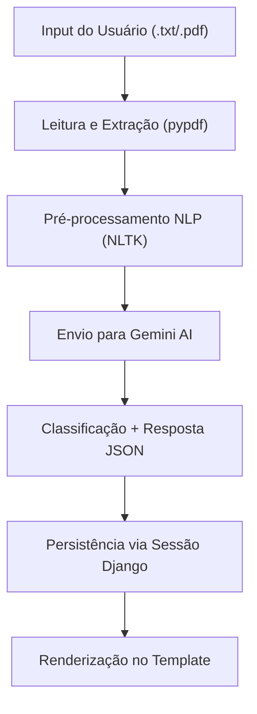

# 📬 MailSense: Classificador Inteligente de E-mails

<p align="center">
  
  
  
</p>

---

## 🧰 Tecnologias Utilizadas

- Python 3.13
- Django 5.2
- Gemini AI (via API)
- pypdf
- NLTK (stopwords, RSLP stemmer)

---

## 💡 Contexto do Projeto

O MailSense é uma solução inteligente para triagem automatizada de e-mails em ambientes corporativos. Utilizando técnicas de NLP e um modelo de linguagem avançado (LLM), ele classifica mensagens como produtivas ou improdutivas e sugere respostas automáticas.

### 🧠 Categorias de Classificação

| Categoria      | Definição                                                                 | Ação Sugerida                                   |
|----------------|---------------------------------------------------------------------------|--------------------------------------------------|
| **Produtivo**  | Requer ação ou resposta específica (ex: dúvidas, solicitações, suporte).  | Sugerir resposta formal e encaminhamento.        |
| **Improdutivo**| Não requer ação imediata (ex: agradecimentos, spam, felicitações).        | Sugerir resposta curta ou nenhuma ação.          |

---

## ⚙️ Arquitetura e Fluxo de Funcionamento



---

## 💻 Instalação e Execução Local

### 1. Pré-requisitos

- Python 3.13
- Git

### 2. Clonando o projeto

```bash
git clone https://github.com/Marianeesouza/MailSense.git
cd MailSense/MailSenseApp
```

### 3. Ambiente virtual e dependências

```bash
python -m venv venv
# Windows
venv\Scripts\activate
# Linux/macOS
source venv/bin/activate

pip install -r requirements.txt
```

### 4. Configuração da API e NLTK

Crie um arquivo `.env` com sua chave Gemini:

```
GEMINI_API_KEY="sua_chave_aqui"
```

Baixe os recursos linguísticos:

```bash
python -m nltk.downloader stopwords rslp
```

### 5. Executando o servidor

```bash
python manage.py migrate
python manage.py runserver
```

Acesse em: [http://127.0.0.1:8000](http://127.0.0.1:8000)
